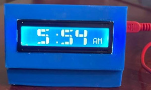
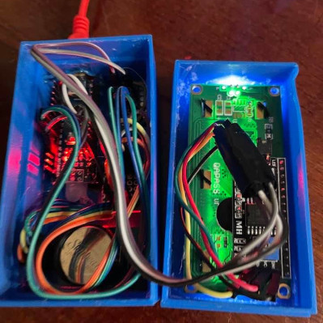
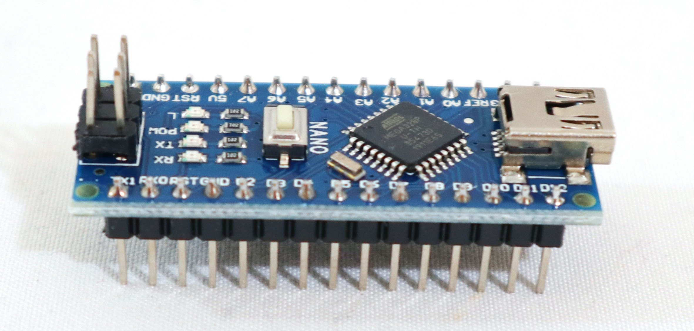

# Digital clock with custom 3D printed case

### The clock in action

### The inside of the clock

#### Parts List
1. Arduino Nano 

3. DS3231 RTC Module
4. 16x2 LCD
5. USB 2.0 A to USB 2.0 Mini B Cable with 5v adapter (powers clock)
6. 3D Printed case
