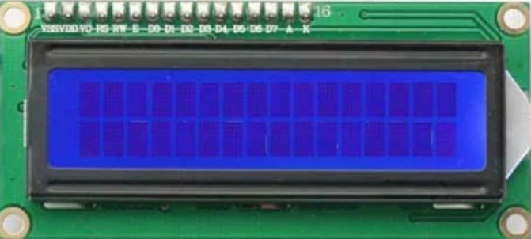

# Digital clock with custom 3D printed case

#### Parts List
1. Arduino Nano 

2. DS3231 RTC Module

3. 16x2 LCD

4. USB 2.0 A to USB 2.0 Mini B Cable with 5v adapter (powers clock)
5. 3D Printed case
